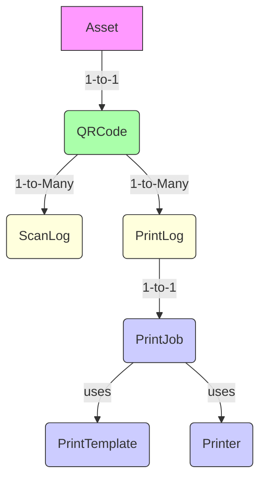

# Architecture du Workflow CMDB Inventory

## 1. Modèles et Relations

## 2. Workflow de Scan
1. Création automatique de QRCode à l'asset creation
2. Scan génère ScanLog avec:
   - Timestamp
   - User/IP
   - Emplacement
3. ScanLog lié à l'Asset via QRCode

## 3. Workflow d'Impression
1. Création PrintJob avec:
   - Liste d'assets
   - Template sélectionné
   - Imprimante cible
2. Génération PDF
3. Création PrintLog pour chaque asset imprimé
4. Stockage des métadonnées d'impression

## 4. Sérialiseurs API
- PrintLogSerializer: Inclut username de l'opérateur
- PrintJobSerializer: Gère la création de jobs
- PrinterSerializer: Configuration des imprimantes

## 5. Endpoints API
- `/api/print-logs/` (GET)
- `/api/printers/` (GET)
- `/api/print-jobs/` (POST)

## 6. Considérations Techniques
- Authentification JWT requise
- Logs d'audit complets
- Gestion des erreurs d'impression
- Suivi des timestamps

> Ce workflow assure une traçabilité complète des opérations de scan et d'impression.