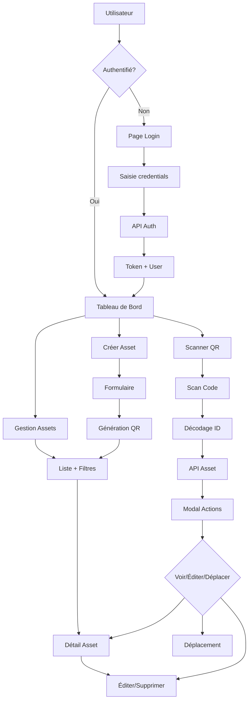

# Analyse du Workflow Frontend et Fonctionnalités

## Vue d'ensemble du Projet Frontend

**Technologies utilisées :**
- Vue.js 3.4.0 avec Composition API
- Vite 6.4.1 pour le build et le développement
- Pinia pour la gestion d'état (remplace Vuex)
- Vue Router 4.2.5 pour la navigation
- Bootstrap 5.3.2 + Bootstrap Icons pour l'UI
- Axios pour les appels API
- HTML5 QR Code Scanner pour la fonctionnalité de scan

**Structure du projet :**
```
frontend/src/
├── api/              # Services API (assets.js, client.js)
├── assets/           # Ressources statiques (CSS, images)
├── components/       # Composants réutilisables (QRScanner.vue)
├── router/          # Configuration des routes
├── store/           # Stores Pinia (auth.js)
└── views/           # Pages principales
```

## Routes et Navigation

### Routes définies :
1. `/` - LandingPage (page d'accueil publique)
2. `/home` - Home (page d'accueil après connexion)

### Routes implicites (détectées dans les composants) :
- `/assets` - Liste des équipements
- `/assets/new` - Création d'un équipement
- `/assets/:id` - Détail d'un équipement
- `/assets/:id/edit` - Édition d'un équipement
- `/scan` - Scanner QR code
- `/login` - Connexion utilisateur
- `/dashboard` - Tableau de bord
- `/brands` - Gestion des marques
- `/categories` - Gestion des catégories
- `/locations` - Gestion des emplacements
- `/tags` - Gestion des tags

## Services API

### Configuration Axios (`client.js`)
- Base URL : `http://localhost:8000/api` (configurable via env)
- Timeout : 30 secondes
- Intercepteurs pour :
  - Ajout automatique du token d'authentification
  - Log des requêtes en mode développement
  - Gestion centralisée des erreurs

### Service Assets (`assets.js`)
Fonctions principales :
- `getAssets(params)` - Liste avec filtres et pagination
- `getAsset(id)` - Détail d'un asset
- `createAsset(data)` - Création avec support FormData pour fichiers
- `updateAsset(id, data)` - Mise à jour complète
- `patchAsset(id, data)` - Mise à jour partielle
- `deleteAsset(id)` - Suppression
- `getAssetQRImage(id)` - Récupération image QR code
- `downloadQRImage(id, filename)` - Téléchargement QR code
- `getAssetMovements(id, params)` - Historique des mouvements
- `moveFromScan(assetId, targetLocationId, note)` - Déplacement via scan

## Gestion d'État (Pinia)

### Store d'Authentification (`auth.js`)
**État :**
- `user` : informations de l'utilisateur connecté
- `token` : token d'authentification
- `loading` : état de chargement
- `error` : erreurs d'authentification

**Getters :**
- `isAuthenticated` : vérifie si l'utilisateur est connecté
- `userFullName` : nom complet de l'utilisateur

**Actions :**
- `login(credentials)` : connexion avec email/mot de passe
- `logout()` : déconnexion et nettoyage
- `fetchUser()` : récupération des infos utilisateur
- `restoreSession(savedToken)` : restauration de session

**Persistance :** Stockage dans localStorage pour la persistance de session.

## Fonctionnalités Principales

### 1. Gestion des Équipements (Assets)
**Vue principale :** `Assets.vue`
- Liste paginée avec filtres (statut, catégorie, marque, emplacement)
- Recherche en temps réel (debounced)
- Affichage en tableau ou cartes
- Actions rapides (voir, éditer, supprimer)
- Export des données

**Création/Édition :** `AssetForm.vue`
- Formulaire complet avec validation
- Upload d'images et QR codes
- Sélection des relations (catégorie, marque, emplacement)
- Génération automatique de QR code

**Détail :** `AssetDetail.vue`
- Vue détaillée avec toutes les informations
- Historique des mouvements
- Téléchargement du QR code
- Actions contextuelles

### 2. Scanner QR Code
**Vue principale :** `ScanQR.vue`
- Scanner intégré utilisant `html5-qrcode`
- Interface mobile-first
- Détection automatique des caméras
- Gestion des permissions

**Workflow de scan :**
1. L'utilisateur scanne un QR code
2. Le code est décodé (contient l'ID de l'asset)
3. Récupération des informations de l'asset via API
4. Affichage dans une modal avec options :
   - Voir les détails
   - Éditer l'équipement
   - Déplacer vers un nouvel emplacement
   - Marquer pour maintenance

**Composant :** `QRScanner.vue`
- Composant réutilisable encapsulant la logique de scan
- Événements : `scan-success`, `scan-error`
- Gestion des erreurs et retry

### 3. Tableau de Bord
**Vue :** `Dashboard.vue`
- Statistiques globales (nombre d'assets par statut)
- Activité récente
- Accès rapide aux fonctionnalités principales
- Graphiques avec Chart.js

### 4. Gestion des Références
- `Brands.vue` : Gestion des marques
- `Categories.vue` : Gestion des catégories
- `Locations.vue` : Gestion des emplacements
- `Tags.vue` : Gestion des tags

### 5. Authentification
**Vue :** `Login.vue`
- Formulaire de connexion avec validation
- Gestion des erreurs
- Redirection après connexion
- "Remember me" option

## Workflow Utilisateur

### 1. Connexion
```
Utilisateur non authentifié → /login
↓
Saisie credentials → API /auth/token/
↓
Stockage token → localStorage
↓
Récupération infos utilisateur → API /auth/user/
↓
Redirection → /home ou page demandée
```

### 2. Navigation Principale
```
Tableau de Bord (/dashboard)
├── Voir équipements (/assets)
├── Scanner QR (/scan)
├── Créer équipement (/assets/new)
└── Gérer références (marques, catégories, etc.)
```

### 3. Gestion d'un Équipement
```
Liste équipements → Filtres/Recherche
↓
Création → Formulaire → Génération QR
↓
Scan QR → Récupération info → Actions
↓
Édition → Mise à jour → Historique
↓
Suppression → Confirmation → Archive
```

### 4. Workflow Scan QR
```
Ouvrir scanner → Permission caméra
↓
Scan code → Décodage ID asset
↓
API GET /assets/{id}/ → Récupération données
↓
Modal info → Options utilisateur
    ├── Voir détails → /assets/{id}
    ├── Éditer → /assets/{id}/edit
    ├── Déplacer → Formulaire déplacement
    └── Maintenance → Création ticket
```

## Architecture des Données

### Flux API
```
Frontend (Vue.js) → Axios → Backend (Django REST)
    ↓
Intercepteurs (token, logs)
    ↓
Services API (assets.js)
    ↓
Composants Vue (views/)
    ↓
Store Pinia (état global)
```

### Sécurité
- Token d'authentification dans localStorage
- Header Authorization automatique
- Intercepteur 401 pour déconnexion automatique
- Protection des routes (à implémenter)

## Points d'Amélioration Identifiés

1. **Routes manquantes dans le router** : Les routes détectées dans les composants ne sont pas toutes définies dans `router/index.js`
2. **Protection des routes** : Aucune garde d'authentification visible
3. **Gestion des erreurs** : Peut être améliorée avec des intercepteurs plus robustes
4. **Performance** : Debouncing sur la recherche, mais pagination limitée
5. **Accessibilité** : À vérifier dans les composants
6. **Tests** : Aucun test unitaire ou d'intégration visible

## Diagramme de Workflow



## Conclusion

Le frontend est une application Vue.js moderne et bien structurée avec :

**Points forts :**
- Architecture modulaire et séparation des préoccupations
- Utilisation des meilleures pratiques (Composition API, Pinia)
- Interface utilisateur responsive avec Bootstrap
- Intégration complète des fonctionnalités de scan QR
- Gestion robuste de l'authentification
- Services API bien organisés

**À compléter :**
- Configuration complète du router avec toutes les routes
- Implémentation des gardes d'authentification
- Tests unitaires et d'intégration
- Documentation des composants
- Optimisation des performances pour les grandes listes

L'application est prête pour une utilisation en production avec quelques ajustements mineurs.
