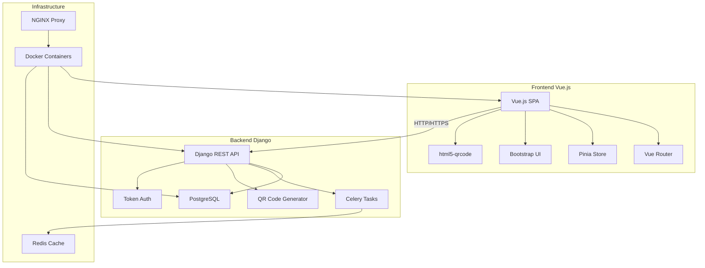
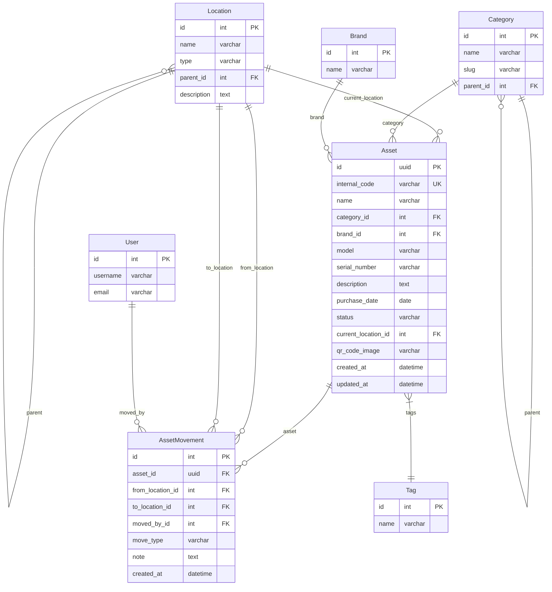
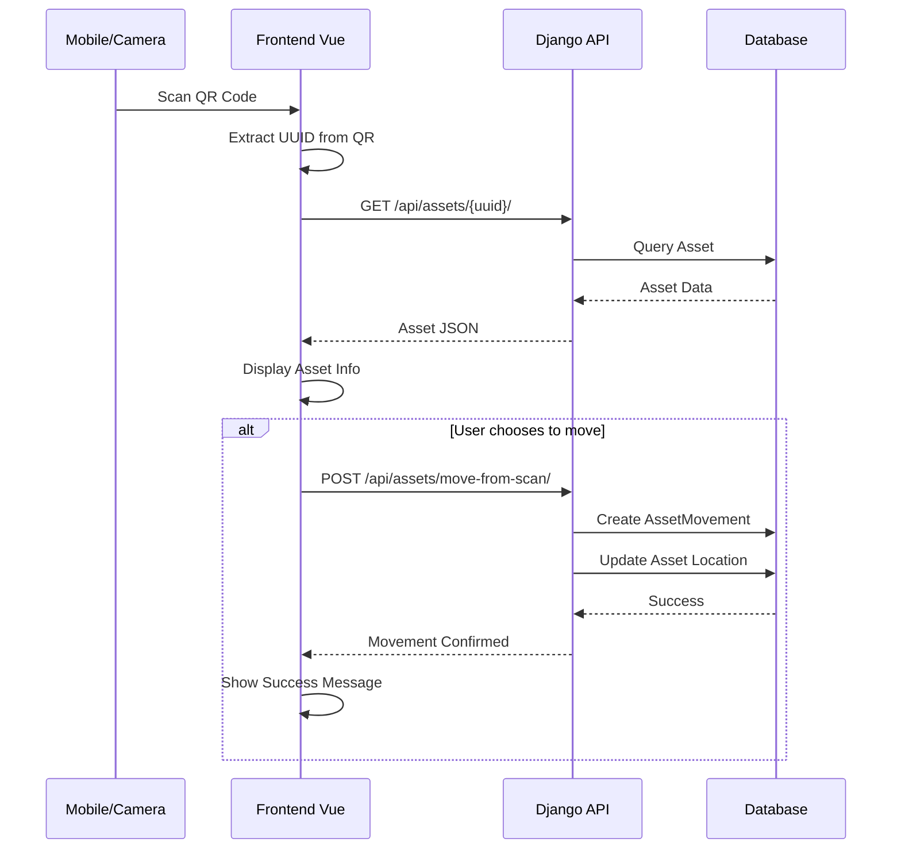
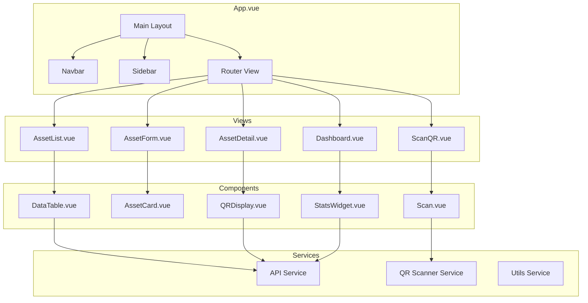
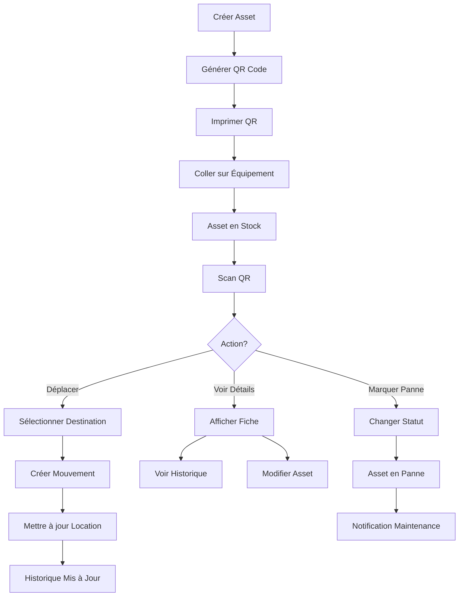
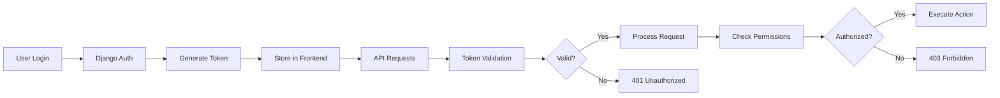

# Diagramme d'Architecture Système - CMDB

## Architecture Globale



## Modèle de Données



## Flux de Données - Scan QR



## Architecture API REST

```mermaid
graph LR
    subgraph "API Endpoints"
        A[/api/assets/] --> B[AssetViewSet]
        C[/api/locations/] --> D[LocationViewSet]
        E[/api/categories/] --> F[CategoryViewSet]
        G[/api/brands/] --> H[BrandViewSet]
        I[/api/tags/] --> J[TagViewSet]
        
        K[/api/assets/{id}/qr_image/] --> L[QR Generator]
        M[/api/assets/move-from-scan/] --> N[Move Handler]
        O[/api/dashboard/summary/] --> P[Dashboard Stats]
        Q[/api/assets/{id}/movements/] --> R[Movement History]
    end
    
    subgraph "Services"
        B --> S[Asset Service]
        L --> T[QR Service]
        N --> U[Movement Service]
        P --> V[Analytics Service]
    end
    
    subgraph "Models"
        S --> W[Asset Model]
        U --> X[AssetMovement Model]
        V --> Y[All Models]
    end
```

## Composants Frontend Vue.js



## Workflow Principal - Gestion d'Asset



## Sécurité et Authentification



Cette architecture garantit une séparation claire des responsabilités, une scalabilité future et une maintenance facilitée du code.