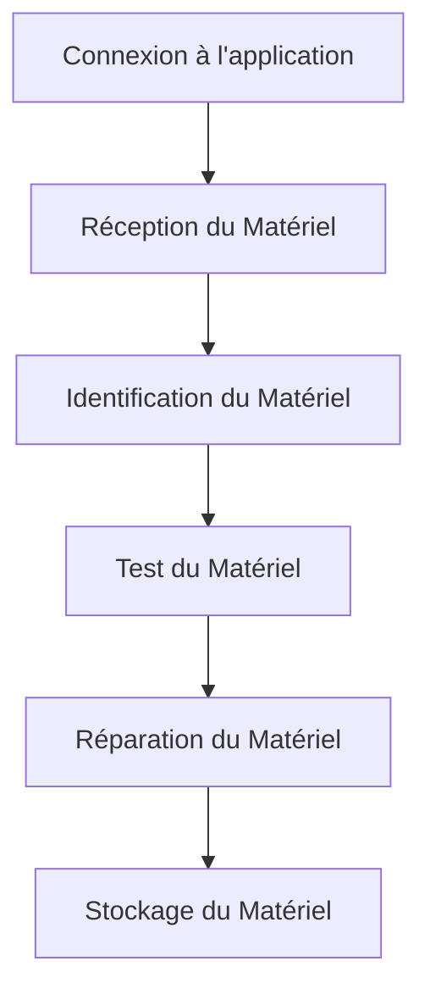

# CMDB Inventory User Manual

## Table of Contents

1. Introduction to CMDB
2. System Overview
3. Features
   - Asset Management
   - Maintenance Tickets
   - QR Code Scanning
   - Search and Filtering
4. Step-by-Step User Guides
   - Adding a New Asset
   - Scanning a QR Code
   - Creating a Maintenance Ticket
5. Troubleshooting
   - Common Issues
   - Solutions
6. Conclusion
7. Parcours Utilisateur (Service Exploitation & Stock)
   - Réception du Matériel Informatique
   - Identification du Matériel
   - Test du Matériel
   - Réparation du Matériel
   - Stockage du Matériel

## 1. Introduction to CMDB

A Configuration Management Database (CMDB) is a centralized database that contains information about the components of an organization's IT infrastructure and the relationships between them. It is a critical tool for IT asset management, helping organizations to track and manage their IT assets effectively.

### Importance of CMDB

- **Asset Management**: Track and manage all IT assets, including hardware, software, and network devices.
- **Incident Management**: Quickly identify and resolve issues by understanding the relationships between IT components.
- **Change Management**: Ensure that changes to IT infrastructure are managed in a controlled and documented manner.
- **Compliance**: Meet regulatory and compliance requirements by maintaining accurate and up-to-date records of IT assets.

## 2. System Overview

The CMDB Inventory system is designed to help organizations manage their IT assets efficiently. It provides features for asset management, maintenance tracking, and QR code scanning for easy asset identification and tracking.

## 3. Features

### 3.1 Asset Management

- **Add New Asset**: Users can add new assets to the system, including details such as internal code, name, category, brand, model, serial number, and more.
- **Edit Asset**: Existing assets can be edited to update their information.
- **View Asset Details**: Detailed information about each asset, including its current status, location, and assigned user, can be viewed.

### 3.2 Maintenance Tickets

- **Create Maintenance Ticket**: Users can create maintenance tickets for assets, specifying the type of maintenance, priority, and due date.
- **Assign Maintenance Ticket**: Tickets can be assigned to specific users for action.
- **Track Maintenance Status**: The status of maintenance tickets can be tracked, including whether they are open, in progress, or closed.

### 3.3 QR Code Scanning

- **Scan QR Code**: Users can scan QR codes to quickly access asset information.
- **Generate QR Code**: QR codes can be generated and downloaded for each asset.

### 3.4 Search and Filtering

- **Search Assets**: Users can search for assets using various criteria such as internal code, name, category, and more.
- **Filter Results**: Search results can be filtered to refine the list of assets.

## 4. Step-by-Step User Guides

### 4.1 Adding a New Asset

1. Navigate to the **Assets** page.
2. Click the **Add New Asset** button.
3. Fill in the required fields such as **Internal Code**, **Name**, **Category**, **Brand**, **Model**, **Serial Number**, and **Description**.
4. Select the **Status** and **Location** of the asset.
5. Click **Save** to add the asset to the system.

### 4.2 Scanning a QR Code

1. Navigate to the **Scan QR** page.
2. Use the QR code scanner to scan the QR code of the asset.
3. The system will display the asset details.

### 4.3 Creating a Maintenance Ticket

1. Navigate to the **Assets** page.
2. Select the asset for which you want to create a maintenance ticket.
3. Click the **Create Maintenance Ticket** button.
4. Fill in the required fields such as **Title**, **Description**, **Priority**, and **Due Date**.
5. Assign the ticket to a user.
6. Click **Save** to create the maintenance ticket.

## 5. Troubleshooting

### 5.1 Common Issues

- **QR Code Scanning Fails**: Ensure that the QR code is clear and not damaged. Check the camera settings and lighting conditions.
- **Search Not Returning Expected Results**: Verify that the search criteria are correct and that the asset information is up-to-date.

### 5.2 Solutions

- **QR Code Scanning Fails**: Try scanning the QR code in a well-lit area and ensure the camera is clean. If the issue persists, regenerate the QR code for the asset.
- **Search Not Returning Expected Results**: Double-check the search criteria and update the asset information if necessary.

## 6. Conclusion

The CMDB Inventory system is a powerful tool for managing IT assets. By following the user guides and troubleshooting tips, you can effectively use the system to track and manage your assets, create and manage maintenance tickets, and ensure the smooth operation of your IT infrastructure.

## 7. Parcours Utilisateur (Service Exploitation & Stock)

### 7.1 Réception du Matériel Informatique

1. **Connexion**
   - Connectez-vous à l'application CMDB Inventory en utilisant vos identifiants.
2. **Réception du Matériel**
   - **Documents Reçus**
     - Facture
     - Bon de livraison
     - Liste d'inventaire
   - **Vérification des Documents**
     - Assurez-vous que tous les documents sont présents et corrects.
   - **Réception Physique**
     - Vérifiez que le matériel reçu correspond aux documents.
     - Notez tout dommage ou anomalie.
3. **Identification du Matériel**
   - **Saisie des Informations**
     - Saisissez les informations du matériel dans l'application CMDB Inventory.
     - Incluez le code interne, le nom, la catégorie, la marque, le modèle, le numéro de série, et la description.
   - **Génération du Code à Barres**
     - Générez un code à barres pour le matériel.
     - Coller le code à barres sur le matériel.
4. **Test du Matériel**
   - **Vérification Fonctionnelle**
     - Testez le matériel pour vous assurer qu'il fonctionne correctement.
     - Notez tout problème ou anomalie.
5. **Réparation du Matériel**
   - **Identification des Défauts**
     - Identifiez les défauts ou problèmes du matériel.
   - **Réparation**
     - Réparez le matériel si possible.
     - Si la réparation n'est pas possible, documentez les raisons.
6. **Stockage du Matériel**
   - **Mise en Stock**
     - Placez le matériel dans le stock approprié.
     - Mettez à jour l'état et l'emplacement du matériel dans l'application CMDB Inventory.

## 8. Exemples Concrets

### 8.1 Exemple de Réception

- **Facture**
  - **Numéro de Facture**: 123456
  - **Date**: 2023-10-01
  - **Fournisseur**: XYZ Technologies
  - **Articles**:
    - PC Portable: 10 unités
    - Écran: 5 unités
    - Imprimante: 3 unités
- **Bon de Livraison**
  - **Numéro de Bon**: 789012
  - **Date**: 2023-10-02
  - **Fournisseur**: XYZ Technologies
  - **Articles**:
    - PC Portable: 10 unités
    - Écran: 5 unités
    - Imprimante: 3 unités
- **Liste d'Inventaire**
  - **Numéro de Liste**: 345678
  - **Date**: 2023-10-03
  - **Articles**:
    - PC Portable: 10 unités
    - Écran: 5 unités
    - Imprimante: 3 unités

## 9. Diagrammes Mermaid

